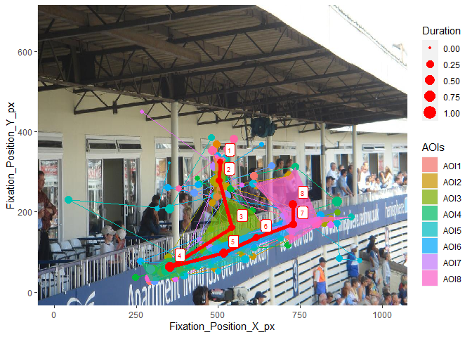

<!-- README.md is generated from README.Rmd. Please edit that file -->

# scanpathAggr

<!-- badges: start -->
<!-- badges: end -->

The goal of scanpathAggr is to find an aggregated view strategy in a
sample through a representative scanpath.

## Installation

<!-- 
You can install the released version of scanpathAggr from [CRAN](https://CRAN.R-project.org) with:

``` r
install.packages("scanpathAggr")
```
 -->

You can install the package using Github, with the remotes package:

``` r
remotes::install_github("HeHuangDortmund/scanpathAggr")
```

For windows system, if you get error massage like "...DLL 'xxx' not found: maybe not installed for this architecture", you should add the "--no-multiarch" in order to avoid installing the packages in multiple arch as follows:
 
``` r
remotes::install_github("HeHuangDortmund/scanpathAggr", INSTALL_opts = c("--no-multiarch"))
```

## Example

This is a basic example which shows how to find a representative scanpath in a sample:

``` r
library(scanpathAggr)

data(scanpath_MIT1003_i1182314083)
reprensentScanpath = scanpathAggr(scanpath_MIT1003_i1182314083, 3)
stimuluspath = system.file('stimulus/i1182314083.jpeg', package = "scanpathAggr")
scanpathVisualisation(scanpath_MIT1003_i1182314083, reprensentScanpath, stimuluspath)
```



